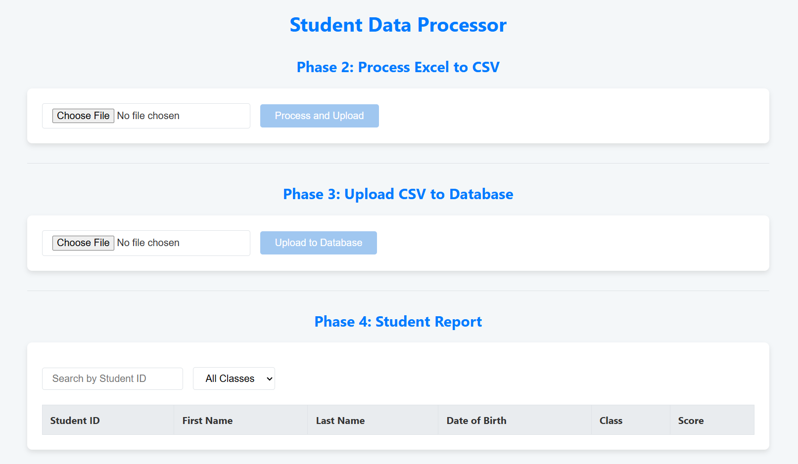
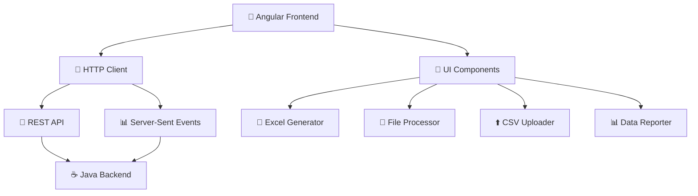

# 🎨 Student Data Processor (Angular Frontend)

<div align="center">


**A modern, responsive Angular frontend for processing massive student datasets** 🚀

*Real-time Progress • Intuitive Design • Seamless Integration*

</div>

---

## 🌟 Application Preview

<div align="center">

)

*✨ Clean, modern interface designed for efficiency and user experience*

</div>

<details>
<summary>📸 <strong>How to Add Your Screenshot</strong></summary>

> **📝 Perfect Screenshot Guide:**
> 
> 1. 🖥️ **Run the application**: `ng serve`
> 2. 🌐 **Navigate to**: `http://localhost:4200`
> 3. 📊 **Ensure all three main sections are visible**
> 4. 📸 **Take a screenshot and save as `app-screenshot.png`**
> 5. 📁 **Place in the `src/assets/` directory**
> 6. ✅ **The README will automatically display it!**

</details>

---

## ✨ Key Features

<table>
<tr>
<td width="50%">

### 🏗️ **Multi-Stage Pipeline**
- 🎯 **Dedicated Components** for each processing step
- 🔄 **Excel-to-CSV** transformation interface
- ⬆️ **CSV-to-Database** upload with progress tracking
- 📊 **Dynamic Results** visualization

</td>
<td width="50%">

### 🚀 **Advanced UI Features**
- 📡 **Real-time Progress** via Server-Sent Events
- ⚡ **Instant Search** by Student ID
- 🎚️ **Smart Filtering** by class
- 🛡️ **Robust Error Handling** with clear feedback

</td>
</tr>
</table>

<div align="center">

### 🎨 **Modern & Responsive Design**

Built with clean CSS for a professional, user-friendly experience across all devices

</div>

## 🏗️ Tech Stack & Architecture

<div align="center">



</div>

### 🛠️ Technology Stack

<div align="center">

| 🎯 **Category** | 🔧 **Technology** | 📝 **Purpose** |
|----------------|-------------------|----------------|
| **🚀 Framework** | Angular 18+ | Modern web application framework |
| **💻 Language** | TypeScript 5.5+ | Type-safe JavaScript development |
| **🎨 Styling** | CSS3 | Responsive, modern UI design |
| **📡 HTTP** | Angular HttpClient | RESTful API communication |
| **⚡ Real-time** | EventSource API | Server-Sent Events for live updates |

</div>

## 🚀 Quick Start

### 📋 Prerequisites

<table>
<tr>
<td width="33%" align="center">

### 📦 **Node.js**
LTS version (20.x)
[Download →](https://nodejs.org/)

</td>
<td width="33%" align="center">

### 🅰️ **Angular CLI**
```bash
npm install -g @angular/cli
```

</td>
<td width="34%" align="center">

### ☕ **Backend Service**
[Java Backend](https://github.com/Casey-Jeremy/student-processor-backend.git) 
must be running on port 8080

</td>
</tr>
</table>

### ⚙️ Installation Steps

<details>
<summary>📦 <strong>Step 1: Clone & Setup</strong></summary>

```bash
# Clone the repository
git clone (https://github.com/Casey-Jeremy/fullstack-angular-frontend)
cd fullstack-student-app

# Install all dependencies
npm install

# Verify Angular CLI installation
ng version
```

</details>

<details>
<summary>🔧 <strong>Step 2: Environment Check</strong></summary>

> **⚠️ Critical:** Ensure the Java backend is running on `http://localhost:8080` before starting the frontend!

**Verify backend is running:**
```bash
curl http://localhost:8080/api/students
```

</details>

<details>
<summary>🚀 <strong>Step 3: Launch Application</strong></summary>

```bash
# Start the development server
ng serve

# Application will be available at:
# 🌐 http://localhost:4200
```

**🎉 Success!** Your Angular frontend is now running and connected to the backend.

</details>

## 🎯 Application Workflow

<div align="center">

### 📊 **Complete Data Processing Pipeline**

</div>

<table>
<tr>
<td align="center" width="25%">

### 1️⃣ **Generate**
🏭 **Excel Creation**
- Set record count (up to 1M)
- Instant download
- Memory-efficient

</td>
<td align="center" width="25%">

### 2️⃣ **Process**  
🔄 **File Transformation**
- Upload Excel files
- Automatic CSV conversion
- Data validation

</td>
<td align="center" width="25%">

### 3️⃣ **Upload**
⬆️ **Database Ingestion**
- Real-time progress
- Batch processing
- Error recovery

</td>
<td align="center" width="25%">

### 4️⃣ **Analyze**
📊 **Dynamic Reporting**
- Paginated results
- Instant search
- Smart filtering

</td>
</tr>
</table>

## 🧩 Component Architecture

### 🎨 **UI Components Overview**

| 🧩 **Component** | 🎯 **Purpose** | ✨ **Key Features** |
|------------------|----------------|-------------------|
| **📄 Excel Generator** | File creation interface | Record count input, download trigger |
| **🔄 File Processor** | Excel-to-CSV conversion | Upload area, transformation status |
| **⬆️ CSV Uploader** | Database ingestion | Progress bar, SSE integration |
| **📊 Data Reporter** | Results visualization | Pagination, search, filtering |
| **🎚️ Interactive Controls** | User interactions | Real-time filtering, instant search |

### 📱 **Responsive Design Features**

<details>
<summary>🖥️ <strong>Multi-Device Support</strong></summary>

- **💻 Desktop:** Full-width layout with side-by-side components
- **📱 Tablet:** Optimized spacing with stacked layout  
- **📱 Mobile:** Single-column layout with touch-friendly controls
- **♿ Accessibility:** WCAG compliant with keyboard navigation

</details>

<details>
<summary>⚡ <strong>Real-time Updates</strong></summary>

- **📊 Live Progress:** Server-Sent Events for upload tracking
- **🔍 Instant Search:** Real-time table filtering  
- **📈 Dynamic Data:** Auto-updating results display
- **🔄 Status Indicators:** Visual feedback for all operations

</details>

<details>
<summary>🛡️ <strong>Error Handling</strong></summary>

- **✅ File Validation:** Size and format checks
- **🌐 Network Resilience:** Graceful error recovery
- **💬 User Feedback:** Clear error messages and guidance
- **🔄 Retry Logic:** Automatic reconnection for SSE

</details>

## 🌐 Backend Integration

### 📡 **API Endpoints**

| 🔥 **Method** | 🎯 **Endpoint** | 📝 **Frontend Usage** |
|---------------|-----------------|----------------------|
| **POST** | `/api/students/generate` | 🏭 Trigger Excel file generation |
| **POST** | `/api/students/process-excel` | 🔄 Upload and convert Excel to CSV |
| **POST** | `/api/students/upload-csv` | ⬆️ Upload CSV with progress tracking |
| **GET** | `/api/students/progress` | 📡 Real-time progress updates (SSE) |
| **GET** | `/api/students` | 📊 Fetch paginated student data |

### 🔌 **Connection Requirements**

> **🚨 Important Setup Note:**
> 
> The **Java Backend Application** must be running before starting this frontend!
> 
> 🔗 **Backend Repository:** [Student Data Processor Backend](https://github.com/Casey-Jeremy/student-processor-backend.git)
> 
> **Default Backend URL:** `http://localhost:8080`

## 🧪 Development & Testing

### 🛠️ **Available Commands**

```bash
# Development
ng serve                 # Start dev server with hot reload
ng build                 # Build for production
ng test                  # Run unit tests with Karma
ng lint                  # Code quality checks

# Advanced Options
ng serve --open          # Auto-open browser
ng serve --port 4300     # Custom port
ng build --prod          # Optimized production build
ng generate component    # Create new component
```

### 📊 **Performance Features**

<table>
<tr>
<td width="50%">

### ⚡ **Optimizations**
- **Lazy Loading:** Route-based code splitting
- **OnPush Strategy:** Optimized change detection  
- **Tree Shaking:** Minimal bundle size
- **Service Workers:** Offline capability ready

</td>
<td width="50%">

### 📈 **Monitoring**
- **Bundle Analysis:** `ng build --stats-json`
- **Performance Metrics:** Lighthouse integration
- **Memory Usage:** DevTools profiling
- **Network Optimization:** HTTP interceptors

</td>
</tr>
</table>

## 🤝 Contributing

<div align="center">

### 🎯 **How to Contribute**

</div>

<table>
<tr>
<td align="center" width="25%">

### 🎨 **UI/UX**
- Enhance designs
- Add animations  
- Improve accessibility
- Mobile optimization

</td>
<td align="center" width="25%">

### 🧪 **Testing**
- Unit tests
- E2E testing
- Performance tests
- Cross-browser testing

</td>
<td align="center" width="25%">

### 📚 **Documentation**  
- Code comments
- User guides
- API documentation
- Tutorials

</td>
<td align="center" width="25%">

### ⚡ **Performance**
- Bundle optimization
- Lazy loading
- Caching strategies
- PWA features

</td>
</tr>
</table>

<details>
<summary>🔧 <strong>Development Workflow</strong></summary>

1. **🍴 Fork** the repository
2. **📥 Clone** your fork: `git clone <your-fork>`
3. **🌿 Create** feature branch: `git checkout -b feature/amazing-feature`
4. **💻 Develop** your feature with tests
5. **🧪 Test** thoroughly: `ng test` && `ng lint`
6. **📝 Commit** with clear message: `git commit -m 'Add amazing feature'`
7. **🚀 Push** to your fork: `git push origin feature/amazing-feature`
8. **🔄 Create** Pull Request with detailed description

</details>

## 📄 License

This project is licensed under the **MIT License** - see the [LICENSE](LICENSE) file for details.

---

<div align="center">

### 🎨 **Ready to Build Amazing Angular Apps?**

```bash
git clone (https://github.com/Casey-Jeremy/fullstack-angular-frontend)
cd fullstack-student-app
npm install && ng serve
```

**⭐ Don't forget to star this repo if you found it helpful!**

</div>
